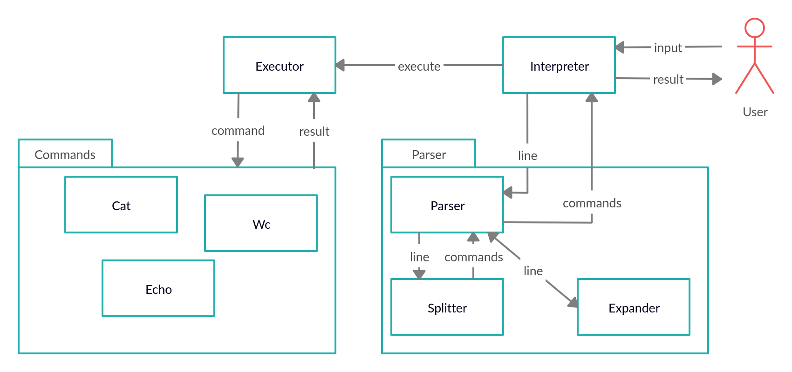

# HW1. Command Line Interpreter

## Usage

Use `interpreter.py` to run CLI

Supported commands:
* `cat`
* `echo`
* `exit`
* `pwd`
* `wc`

Also supports pipes and variables assignment

## Example

```
>echo "Hello, world!"
Hello, world!
> FILE=example.txt
> cat $FILE
Some example text
> cat example.txt | wc
1 3 18
> echo 123 | wc
1 1 3
> x=exit
> $x

```
## Architecture

Основной класс — Interpreter, он осуществляет взаимодействие с пользователем: считывает входную строчку, 
потом отправлет её классу Parser попарсить, а потом классу Executor выполнить команды

Класс Parser сначала вызывает использует класс Expander, который выполняет все расширения (сейчас только замену переменных),
а потом Splitter, который делить строчку на команды по пайпам, а те — на токены по пробелам

Класс Executor последовательно выполняет команды, используя вывод предыдущей команды как ввод для следующей

Все команды реализованы как отдельные классы — наследники абстрактного класса Command


